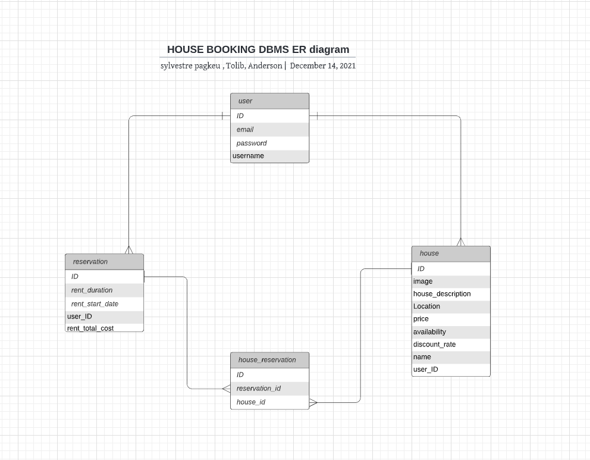

# Final group capstone - House Reservation: Back end


> The project we built for the Final Capstone Project is based on an app to book/reserve a house for rental. We will be following the given design of the website, while personalising the content.

Project requirements can be found [here](https://github.com/microverseinc/curriculum-final-capstone/blob/main/projects/business_requirements.md)

## Project DBMS ER Diagram



## Frontend Pull Request

[Github PR](https://github.com/andersonlebon/Final-capstone-frontend-/pull/15)

[API-Live](https://house-booking-api.herokuapp.com)

## Kanban board
We are three in this team:  
- [ ] Team member A is @pasytchangwa
- [ ] Team member B is @toliboff
- [ ] Team member C is @andersonlebon

Here is the link to the project [Kanban board](https://github.com/andersonlebon/Final-Capstone-backend/projects/1)

[Kanban board initial state screenshot](https://drive.google.com/file/d/1HfBGorTIt5VthTBYDFuNdxRyPos0eSAK/view?usp=sharing)

## Documentations

Folow this [link](https://house-booking-api.herokuapp.com/api-docs/index.html) to see the documentation of the API.

## Built With

- Ruby on Rails
- PostgreSQL

## Getting Started

To get a local copy up and running follow these simple example steps.

### Prerequisites

- [Ruby](https://www.ruby-lang.org/en/)
- [Rails](https://gorails.com/)

### Setup

- Make sure you have Ruby on Rails set up properly on your computer
- Clone or download this repo on your machine
- Enter project directory

### Install

```sh
bundle install
```

### Database

```sh
# Create user
sudo -u postgres createuser booking_app -s

# Create the database
rails db:create

## Apply migration
rails db:migrate

# Load the schema
rails db:schema:load
```

### Run

```sh
rails s
```

### Test

```sh
rails spec
```

### Troubleshoot

```sh
### Rspec failing
RAILS_ENV=test rails db:reset
```

```sh
### New Scaffold
rails g scaffold_controller model
```

```sh
### Undo migration
rake db:migrate VERSION=0
```

## Authors

👤 **Sylvestre**

- GitHub: [@sylvestre](https://github.com/pasytchangwa)
- Twitter: [@Sylvestre](https://twitter.com/Sylvest10415595)
- LinkedIn: [Sylvestre Tchangwa](https://www.linkedin.com/in/pagkeusylvestre/)

👤 **Tolib**

- GitHub: [@toliboff](https://github.com/toliboff)
- Twitter: [@toliboff](https://twitter.com/tolib_tolibov)
- LinkedIn: [Tolibjon Tolibov](https://linkedin.com/in/tolibjon-tolibov)

👤 **Anderson Caleb**

- GitHub: [@Andersonlebon](https://github.com/andersonlebon)
- Twitter: [@BuyananaCaleb](https://twitter.com/BuyananaCaleb)
- LinkedIn: [@Anderson Caleb](https://www.linkedin.com/in/anderson-caleb-915343209/)

## 🤝 Contributing

Contributions, issues, and feature requests are welcome!

Feel free to check the [issues page](../../issues/).

## Show your support

Give a ⭐️ if you like this project!

## Acknowledgments

- Microverse
- Original design idea by Murat Korkmaz on [Behance](https://www.behance.net/muratk).

## License

[MIT](./LICENSE)
